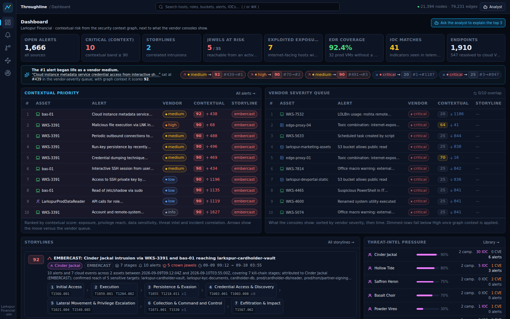
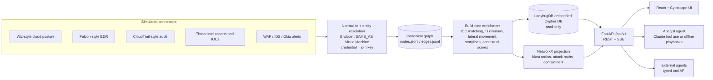
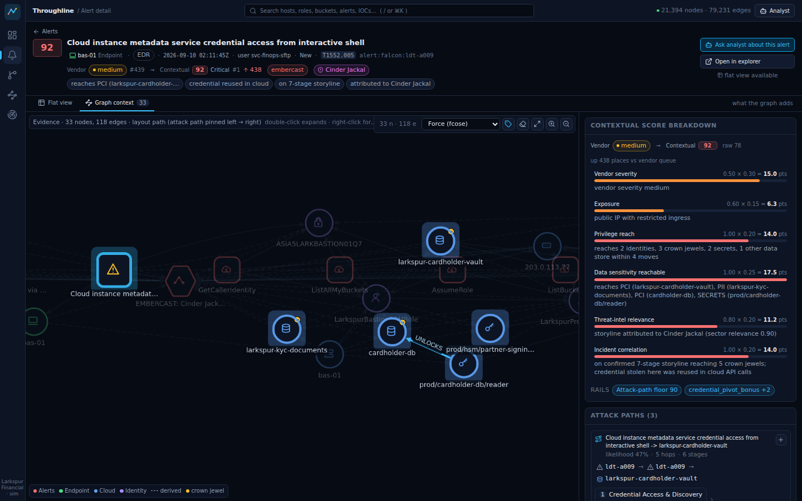
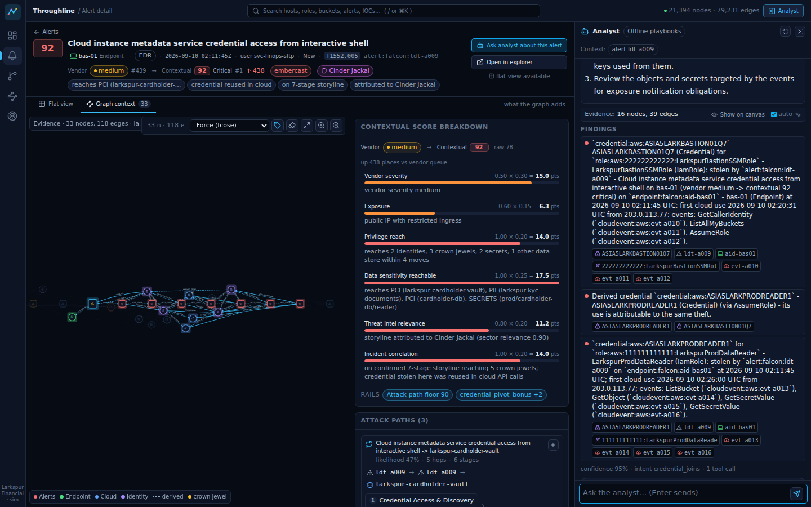
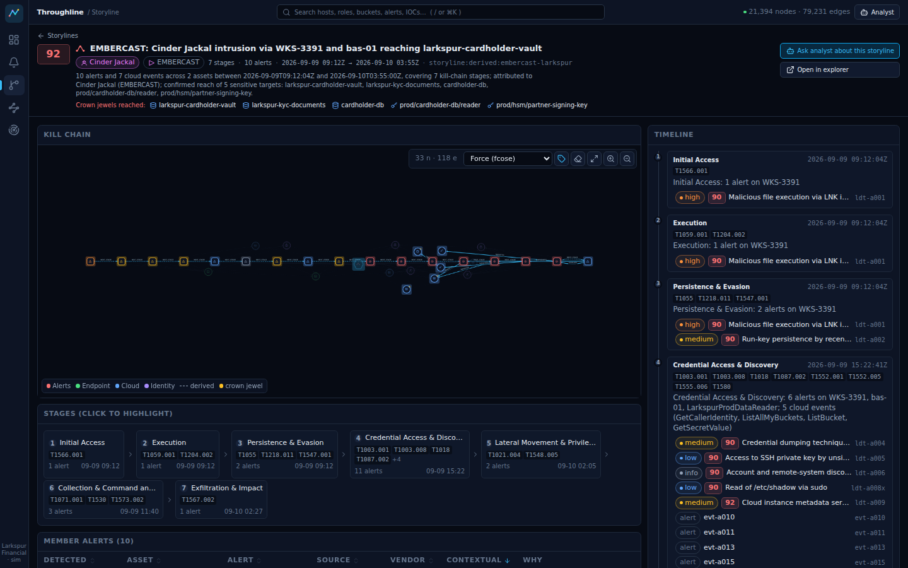
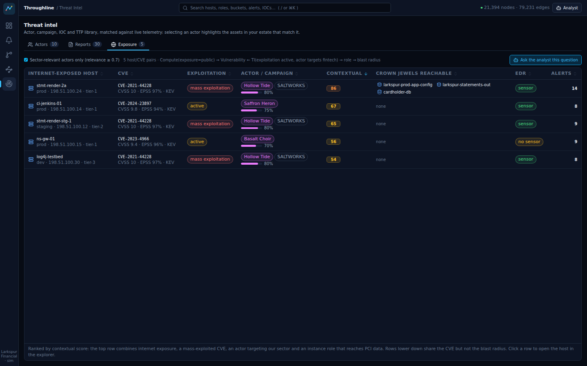

# Throughline

**A security context graph that fuses cloud posture, endpoint (EDR) telemetry and threat-intelligence impact, so a human or AI analyst can ask questions about an alert and get answers no single tool can give.**

Throughline is a working prototype from a fictional startup. It extends a Wiz-style cloud security graph (accounts, workloads, identities, permissions, exposure, data stores, vulnerabilities) with CrowdStrike Falcon / Cortex XDR-style endpoint telemetry (devices, processes, detections, credential theft, lateral movement) and with threat-intelligence-derived impact metadata (actors, campaigns, exploited CVEs, indicators). On top of that graph it runs explainable analytics (blast radius, attack paths, contextual re-ranking, storyline correlation) and exposes them to a Wiz-like UI, to a chat-based analyst assistant, and to external AI agents through a typed tool API.

Everything in the repository is simulated. The customer (Larkspur Financial), its people, its estate, the threat actors, campaigns, malware, indicators and intel reports are fictional. Real CVE identifiers appear for realism; their attribution to fictional actors is fictional.



## What the demo proves

The estate contains two live intrusions and a lot of noise:

* **EMBERCAST (fictional actor Cinder Jackal).** Phishing on an employee workstation, credential theft, SSH to a bastion that is also a cloud VM, theft of the instance role's credentials from the metadata service, cross-account role assumption into production, and bulk download of the cardholder data vault. The EDR sees a handful of *medium* alerts on two hosts. The cloud audit log sees "valid credential" API calls. Neither connects them.
* **SALTWORKS (fictional actor Hollow Tide).** Mass exploitation of Log4Shell on an internet-exposed statement-rendering service whose instance role can read a config bucket holding database credentials. The WAF logs one *medium* exploit-string alert among thousands.
* **Noise.** A Critical CSPM finding on a public marketing bucket, a High EICAR test-file detection on an isolated dev VM, an admin's PsExec inside an approved change window, an "impossible travel" login that is really the VPN, scanner traffic, quarantined attachments, and hundreds of routine posture issues.

With the graph, the *medium* credential-dumping alert on the bastion becomes the #1 priority (contextual score 90+) because five hops away it reaches PCI data; the Critical public-bucket finding drops to noise because the bucket holds public assets and no actor is interested; the Log4Shell host ranks #2 because threat intel says the vulnerability is being mass-exploited against fintechs right now. Every score comes with its factor breakdown and evidence.

The twelve analyst questions the prototype answers deterministically (no LLM key required) are listed in [docs/04-storyline.md](docs/04-storyline.md#6-expected-answers-to-the-12-demo-questions-used-by-scenario-tests); the founder demo script is in [docs/01-product-definition.md](docs/01-product-definition.md#9-demo-script-live-founder-walkthrough).

## Quick start

Requirements: Python 3.11+, Node 22+, about 2 GB of disk. No Docker, no cloud accounts, no API keys.

```bash
make setup      # python venv + web dependencies
make demo       # simulate the estate, enrich the graph, build the embedded graph DB, build the UI, serve
# open http://127.0.0.1:8000
```

Useful variants:

```bash
make data                       # (re)generate data/generated (~25k nodes, ~90k edges) and the LadybugDB file
make ask Q="Which credentials used in cloud API calls today were seen being stolen on an endpoint?"
.venv/bin/python scripts/demo_questions.py           # run all twelve demo questions through the offline analyst
make test                       # unit, conformance, API and scenario tests
make dev                        # API with reload + Vite dev server (http://localhost:5173)
```

To use Claude as the analyst instead of the deterministic playbooks, set `ANTHROPIC_API_KEY` (and optionally `ANTHROPIC_MODEL`, default `claude-opus-5`) in `.env`. The offline analyst is automatically used when no key is present or the API fails.

## Five-minute demo

1. Open the **Dashboard**. The contextual leaderboard puts a vendor-*medium* endpoint alert on the bastion at #1 (score 92) next to a vendor-severity queue full of criticals that score 20-25. Click the callout to see the rank move.
2. Open **Alerts**, click the "Medium EDR alerts with a path to regulated data" chip, then open the top row (bastion credential access). Flip between **Flat view** (what the EDR console shows) and **Graph context** (path to the cardholder vault, score breakdown, insights with hop counts).
3. Press **Ask analyst about this alert** and type: *Trace the full attack path from the phishing detection on WKS-3391 to any regulated data store.* The seven-stage path renders on the canvas as the answer streams.
4. Ask: *Which credentials used in cloud API calls today were seen being stolen on an endpoint?* The two temporary AWS keys join the endpoint theft to the cloud audit trail.
5. Open **Threat Intel > Exposure** or ask: *Which internet-exposed hosts have a vuln a threat actor is actively exploiting against fintechs right now?* The Log4Shell statement service ranks first because of exposure, mass exploitation and its role's reach.
6. Ask: *Is the 'S3 bucket public' critical finding actually risky?* Public data, no privilege, no actor interest: contextual 25.
7. Open **Storylines > EMBERCAST**, run the containment simulation (isolate the bastion, rotate the role): what is cut, what breaks, what residual risk remains.
8. Open **Graph Explorer > Cypher** and run one of the schema's example queries against the embedded graph database.

## Share it with the team

Three ways, from zero setup to a real deployment:

1. **The static edition (no server at all).** Every payload the UI needs is precomputed from the simulated graph and
   shipped as plain files with the web bundle, so the whole prototype runs from any static host. It is published as a
   private Claude artifact (share it from the page's share menu), and the `pages` workflow deploys it to GitHub Pages
   on every push at <https://domdivakaruni.github.io/SampleTempalates/> once Pages is switched on (one-time:
   Settings -> Pages -> Source "GitHub Actions"; until then the workflow attaches the built site to each run as the
   `throughline-static` artifact). Rebuild it locally with
   `make static` (about 70 seconds) and verify it with `make static-check`. The dashboard, alerts, storylines,
   explorer, threat intel and the analyst all work; the analyst replays 122 prepared answers (all twelve demo
   questions, the storyline questions and six questions per storyline alert) and explains itself on anything else,
   and the Cypher console is disabled. Details in [docs/10-static-snapshot.md](docs/10-static-snapshot.md).
2. **The prebuilt container (full product, one command).** The `docker` workflow publishes the image to GitHub
   Container Registry on every push; anyone with Docker runs
   `docker run --rm -p 8000:8000 -e DEMO_PASSWORD=throughline ghcr.io/domdivakaruni/sampletempalates:latest`.
3. **A hosted deployment.** The same container runs anywhere that gives you an HTTPS URL; set `DEMO_PASSWORD` so
   the link is not open to the world:

   ```bash
   gcloud run deploy throughline --source . --region us-central1 --memory 2Gi --allow-unauthenticated \
     --set-env-vars DEMO_USER=team,DEMO_PASSWORD='pick-a-strong-one'
   ```

   Fly.io (`fly.toml`), Render (`render.yaml`) and `docker compose up` are covered in
   [docs/09-deployment.md](docs/09-deployment.md).

## Architecture in one picture



Decisions and trade-offs are recorded in [docs/02-architecture.md](docs/02-architecture.md). In short: the demo runs on **LadybugDB**, the maintained fork of Kuzu (embedded, Cypher, zero infrastructure); the same `GraphStore` interface has a **Neo4j** backend for server deployments and a NetworkX fallback; the canonical data is engine-neutral JSONL so BigQuery Graph can consume the same tables later; analytics with custom edge semantics run on an in-process NetworkX projection; and the analyst agent uses the same typed, read-only tools whether it is Claude or the deterministic playbook engine.

## Screens

| Screen | What it shows |
|---|---|
| Dashboard | Contextual leaderboard next to the vendor-severity queue, storyline cards, coverage, threat-intel pressure |
| Alerts | Every alert with vendor severity and contextual score side by side, "why" chips, storyline and TI badges |
| Alert detail | **Flat view** (exactly what the vendor console shows) vs **Graph context** (evidence subgraph, risk breakdown, insights with hop counts, blast radius, attack paths, storyline) |
| Storylines | Correlated multi-stage intrusions with kill-chain stages and a containment simulator |
| Graph explorer | Search, expand, filter, path finder, blast radius, attack paths and a read-only Cypher console |
| Threat intel | Actors, campaigns, reports and the "exposed hosts with actively exploited vulnerabilities" table |
| Analyst drawer | Chat with streaming answers, live tool calls, evidence highlighted on the canvas, cited node ids |

Screenshots (captured from the running prototype on the simulated dataset):

| Alert detail, graph context | Analyst drawer answering question 8 |
|---|---|
|  |  |

| Storyline kill chain | Threat-intel exposure table |
|---|---|
|  |  |

The full set is in `docs/screenshots/`; regenerate them with `make screenshots` while `make serve` is running.

## Repository layout

```
throughline/            Python package
  schema/               canonical labels, edge types, typed columns (compiled to DDL)
  simulator/            deterministic data simulation: inventory, threat_intel, events stages + build pipeline
  graph/                GraphStore backends (LadybugDB/Kuzu, NetworkX, Neo4j), loader, Cypher gate
  analytics/            enrichment, scoring, blast radius, attack paths, correlation, insights, containment
  agent/                tool registry, Claude tool-use loop, offline analyst, sessions
  api/                  FastAPI application and routers
web/                    React + TypeScript + Cytoscape UI
docs/                   product definition, architecture, schema, storyline, API contract, build plan
tests/                  unit, conformance (per backend), api, scenarios (the twelve questions on real data)
scripts/                demo question runner, screenshots
data/fixtures/          small committed fixture graphs; data/generated is built locally
```

## Documentation

1. [Product definition](docs/01-product-definition.md): purpose, users, the graph-advantage questions, the scoring concept, storyline, demo script.
2. [Architecture](docs/02-architecture.md): graph database comparison and decision, data model conventions, analytics design, agent design, founder decisions.
3. [Graph schema](docs/03-graph-schema.md): every label, property, edge type and the entity resolution rules.
4. [Storyline and ground truth](docs/04-storyline.md): the simulated estate, both intrusions, the noise, and the expected answers.
5. [API and tool contract](docs/05-api-contract.md): REST endpoints, SSE events, the analyst tool set.
6. [Build plan](docs/06-build-plan.md): module ownership and interfaces.
7. [Agent and API notes](docs/07-agent-and-api.md): how the analyst works, safety, using the tool API from your own agent.
8. [Critique log](docs/08-critique-log.md): the review rounds after the first build and what changed.
9. [Deployment](docs/09-deployment.md): container image, Cloud Run, Fly.io, Render, the prebuilt image, password gate.
10. [Static snapshot edition](docs/10-static-snapshot.md): the no-backend build (exporter, snapshot transport, GitHub Pages and artifact publishing) and what it can and cannot do.

## Configuration

All settings are environment variables (see `.env.example`): graph backend (`ladybug`, `kuzu`, `networkx`, `neo4j`), Neo4j connection, simulation seed and scale, Anthropic model and effort, agent mode (`auto`, `llm`, `offline`), host and port.

## Status and limitations

This is a prototype built to demonstrate a capability, not a product. The data is simulated and deterministic; the connectors are generators shaped like vendor APIs rather than API clients; the Neo4j backend is implemented but not exercised in this repository's tests; the LLM analyst path is tested with a fake client. See the "Path to production" section of the architecture document for what changes next.

## License

Apache-2.0. See [LICENSE](LICENSE).
